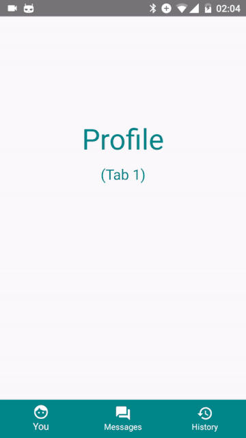
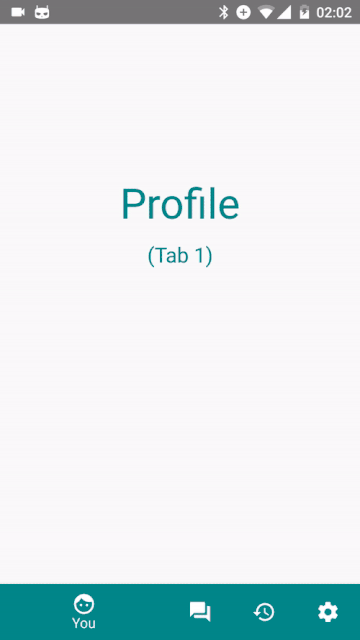

# Native BottomNavigation for react-native

### Note: Development switched to [timomeh/react-native-material-bottom-navigation](https://github.com/timomeh/react-native-material-bottom-navigation)**

This is a bridge to Android's native [BottomNavigation](https://material.io/guidelines/components/bottom-navigation.html). Because this is a Native Component, it only works with Android, not with iOS.

Heavily inspired by react-native's implementation of ToolbarAndroid.

 


## Example

```js
<BottomNavigation
  style={{ backgroundColor: '#009688', height: 56, position: 'absolute', bottom: 0, left: 0, right: 0 }}
  activeTab={0}
  tabs={[
    { title: 'Tab 1', icon: require('./icon1.png') },
    { title: 'Tab 2', icon: require('./icon2.png') },
    { title: 'Tab 3', icon: require('./icon3.png'), disabled: true }
  ]}
  labelColors={{
    default: 'white',
    active: 'red',
    disabled: 'black'
  }}
  iconTint={{
    default: 'white',
    active: 'red',
    disabled: 'black'
  }}
  onTabSelected={activeTab => console.log(activeTab)}
/>
```

## Options

All currently available options are used in the example above.

- `activeTab` sets the active Tab.
- `tabs` is the configuration for the rendered Tabs.
  - Up to 5 Tabs possible.
- `labelColors` sets the color of the Tab's Label for the given state.
- `iconTint` sets the tintColor of the Tab's Icon for the given state. (DOESN'T WORK CURRENTLY)
- `onTabSelected` is a click listener with one parameter, which returns the index of the pressed Tab.

## TODO

- Get `iconTint` to work. Maybe it has something to do with Fresco? Don't know.
